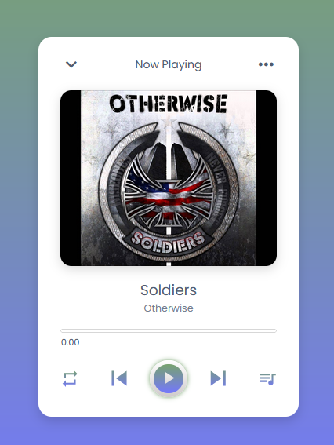
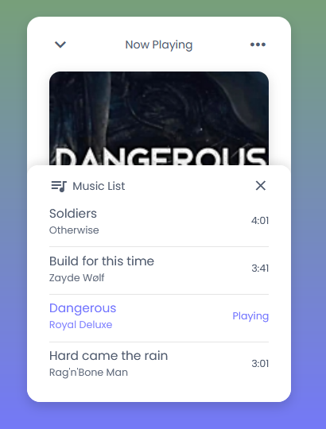

# Music Player
 
Projeto desenvolvido principalmente para a prática de Javascript.
 
 

## Seja bem vindo ao meu gosto musical!
 

## 💻 Sobre o projeto
 
Esse Player é bastante simples no quesito de opções de interação.
Nesse momento não é possível inserir novas músicas ou excluir uma que já exista no repertório.
Apenas podemos ouvir o que já foi escolhido.
 

 

## Screenshot das telas do site 
 

### Tela Principal do Player
 
 
 

### Tela da Lista de Músicas Disponíveis
 
 
 
 

## Licença
Este projeto esta sob a licença MIT.
